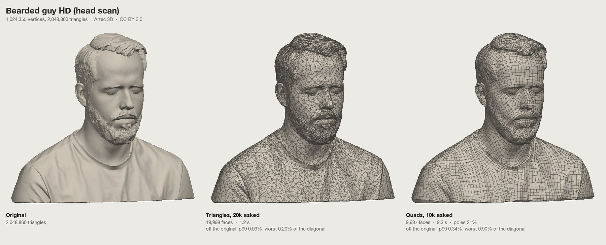
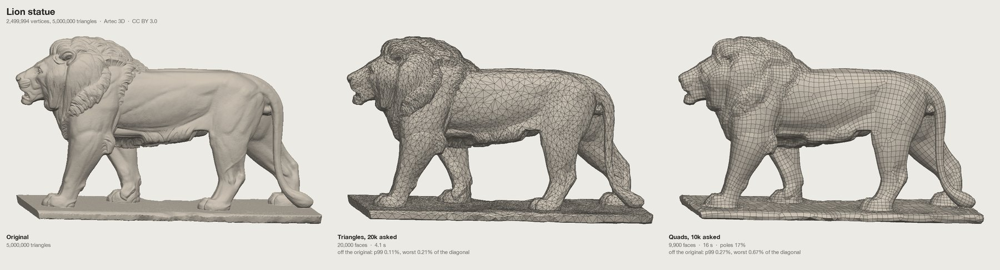
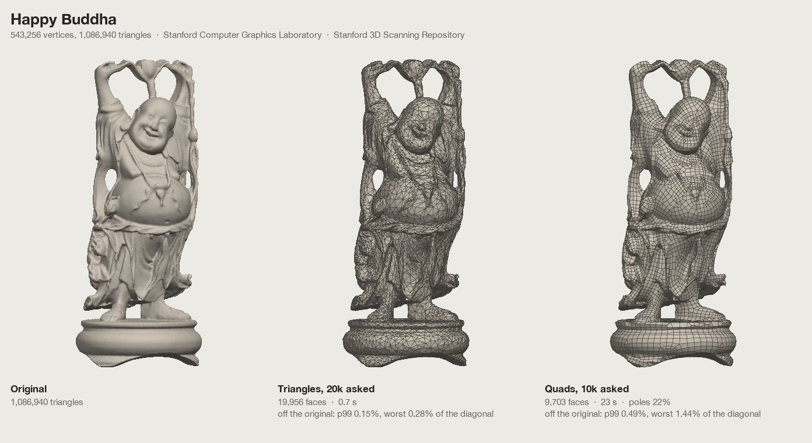

# Poly Budget

Bring heavy 3D models down to a triangle budget in the browser, without losing their look, as reduced triangles or as a clean all-quad remesh.

**Open it:** https://ozdeger.github.io/poly-budget/

> [!NOTE]
> **Written by AI, not maintained by hand.** Everything in this repository, the code, the tests and this README, is written and revised by an AI coding assistant (Claude, working in Claude Code) from its owner's requests. None of it is written or kept up to date by hand. Treat it as generated code: check what it produces before you rely on it, and read the code before you reuse it.

Poly Budget is for models that are far too dense for real-time use: scans, sculpts and AI-generated meshes that arrive with a million or more triangles, split vertices and thousands of UV islands. Set a triangle budget, paint where the detail matters (surface no one can see gets less on its own), and export a model whose textures still fit. Switch the budget to **Quads** and the model is rebuilt as quads whose edges follow its shape instead, ready for editing, subdivision and rigging.

Everything runs in your browser. Models and textures are never uploaded.

## Examples

Scans of a million triangles and more, each shown as the original, reduced to 20,000 triangles, and remeshed into 10,000 quads. The numbers under each result are its faces, the time it took (in Node on an Apple M5 Pro), and how far the original's surface lies from it: at the 99th percentile and at worst, as a share of the model's diagonal. The models are in the [test collection](#develop).

The pictures show these models reduced and remeshed by Poly Budget: Bearded guy HD and the lion statue by Artec 3D (CC BY 3.0), and the Happy Buddha from the Stanford 3D Scanning Repository (Stanford Computer Graphics Laboratory).

## What it does

### Open a model

- FBX, GLB/glTF, OBJ with its MTL, STL and PLY, with PNG, JPG, WebP, TGA, BMP or GIF textures. Choose the files or drop them on the view, or start with the built-in sample pawn.
- Textures are matched to materials by the names the model asks for. Files it doesn't name are placed by their own name: normal, roughness, metal, AO and emissive maps are recognised, anything else becomes the base colour.
- The Texture section shows every material's maps as thumbnails. Click one to replace it; a missing file shows as a dashed tile until you provide it.
- Files often store a copy of each vertex per triangle corner, which decimators can't collapse, so vertices are welded first. Normals further apart than the hard edge angle stay split. Keep the merge distance low: a large one joins separate surfaces that come close.
- A file without vertex normals (many OBJ and STL exports) gets smooth normals worked out from its surface, and a normal map that an MTL lists under `map_Bump` is used as a normal map.

### Set the budget

- Type a triangle count, a short count like `20k`, or a share like `5%`. The slider runs from 0.1% to 100% on a log scale, and there are 50, 25, 10, 5 and 1% presets.
- The result sits right under the budget: triangles and vertices, how long the reduction took, the deviation from the original (average and largest distance, sampled at 4,000 points, as a share of the model's size), the texture state, and a bar of how the triangles split between painted regions.
- When a result misses the budget, it says why (Keep areas too large, the error limit, UV seams) and offers the fix in one click when there is one.
- Reduction options fine-tune the pass: an error limit that stops early, optimised vertex positions, even or very even triangles, how strongly shading is protected, locked open borders, and removal of tiny floating parts (pieces under 1% of the model's size). Normals are kept from the file, made smooth from the original's dense surface, or creased at an angle.

### Triangles or quads

The toggle at the top of the budget picks what comes out.

- **Triangles** reduces the model's own triangles, as described above. It keeps the most shape for the fewest triangles.
- **Quads** rebuilds the surface as a new mesh of quads, at the budget's triangle count divided by two. The edges run along the shape, around limbs and across faces, so the result can be edited, subdivided and rigged. Unity still counts it as triangles (two per quad), so the budget means the same in both modes.
- In Quads mode the budget is typed and shown in quads (`12500`, `12.5k`); a percentage is still of the original triangles. Remeshing can't hit an exact count: it lands within a few percent, which counts as on budget.
- Every face is a quad. The result card adds the quad count and the poles: vertices where other than four quads meet, which is where edge loops start and end.
- Painting sets the quad size: More detail gives 2, 4 or 8 times as many quads per area, Less detail ½, ¼ or ⅛, and Keep the smallest quads (8 times). Separate small pieces always keep at least a few quads, unless Remove tiny floating parts is on.
- Quads come out evenly sized, while a triangle reduction crowds its triangles onto the detail. At game budgets, paint More detail on faces and hands in Quads mode, or eyes and lips smooth away.
- **Keep sharp edges** (on by default) turns edges sharper than 45° into edge loops, so the rims and corners of hard-surface parts stay crisp instead of being bevelled. Short sharp runs, which on scans and AI meshes are surface noise, are ignored; "short" is measured in the local quad size, so where quads get small, shorter edges count.
  - Edges on both sides run along a kept sharp edge, and a grid line passes through it. On a flat face beside a crease, the edges used to run any way at all and meet the crease at an angle.
  - The two sides of a sharp edge share its edge loop, so with Follow the shape they share the step along it. The small steps around a cylinder carry onto its flat cap, where they widen gradually toward the middle, instead of meeting the cap's big quads at the rim and notching it.
  - On a cylinder with Follow the shape at 100%, 99% of the rims now lie on an edge loop, up from 86%; on a gear, 73% of its creases, up from 48%. Capped shapes pay a few poles for it, since a flat cap has to turn its grid all the way around its rim.
- **Follow the shape** (75% by default) sizes and stretches each quad by the surface under it. A quad side of length h along a direction in which the surface bends by κ misses it by about κh²/8. For the same small error in every direction, a quad is short across the direction the surface bends most and long along the direction it bends least. A chain, strap or strand of hair gets long quads along it and several edges around it; a skirt fold gets long quads down the fold; a flat back gets big square ones. Square quads that keep the same error need several times as many wherever the surface bends mostly one way: three times as many over a whole generated character.
  - The edge flow follows the shape too: where quads stretch, the edges turn to run along the direction of least bending.
  - The curvature is measured once per model, over patches about 0.3% of its size. Its signed averages cancel the noise of scans and generated meshes, and edges kept sharp are left out.
  - Quads stay between 0.15 and 2.5 times the average size, and at most four times longer than wide. Sizes change gradually from place to place, so the grid can follow them.
  - Higher values follow the shape more closely, and changes of size cost poles. On a generated character at 21k quads, 0% misses the original by 0.078% of the model's size on average, with one vertex in nine a pole. 75% misses by 0.052%, with one pole in five or six vertices. 100% misses by 0.049%, with one in five. At 75% a necklace comes out as a round tube with long quads along it, instead of a flattened ribbon.
- **Fewer poles.** A quad side may get longer or shorter freely along its own direction, but across it only as fast as the edges bend. Sizes that change faster than that make the grid start extra rows of quads, and every row that starts or ends inside the surface leaves a pair of poles. So before the grid is laid, the sizes are adjusted where the ones the shape asks for can't be tiled, as little as possible and never much larger. Painted sizes are kept as painted. On two generated characters at 21k and 20k quads, this cut the poles from 23.7% to 19.3% and from 23.9% to 20.0% of the vertices, for 2 to 4% more average deviation. A torus, which needs no poles at all, gets half as many.
- Triangles mode does this by itself. The simplifier always takes the collapse that moves the surface least, so flat areas merge into large triangles first, small forms keep theirs, and triangles come out stretched the same way. For crisp small hard-surface details at a low count, Triangles mode is still the better choice.
- Mirror symmetry works the same way: the kept half is remeshed with the mirror plane held as an edge loop, then mirrored, so every vertex has its partner. Once mirrored, a vertex on the plane has its two edges along it plus twice its edges into the kept half, so it is regular only with exactly one edge inward, and the remesher lays the seam out for that. On a generated character, vertices on the seam with only two edges (a quad folded flat against the plane) fell from 12% to 4% of the seam, and those with six or more from 14% to 7%, while the poles overall went slightly down.
- A quad mesh has new topology, so its UVs are always new: the texture is baked onto them from the original, as for New UVs. The unwrap never cuts a quad in two.
- Normals are taken from the original surface where each new vertex sits (Original or Smooth), or creased at an angle.
- FBX and OBJ store the faces as quads. GLB can only hold triangles, so it gets two per quad.

Quads mode takes longer than a reduction, with the progress in the result card. For the example models at 10,000 quads it took 9 to 23 seconds; some shapes in the test collection take up to about two minutes (in Node on an Apple M5 Pro).

### Paint where detail matters

Pick a tool from the palette on the left of the view; its options float above the model.

| Tool | Key | What the painted area gets |
| --- | --- | --- |
| More detail | M | the detail a 2, 4 or 8 times larger budget would keep there |
| Less detail | L | ½, ¼ or ⅛ of the triangles it would get otherwise |
| Keep original | K | its vertices stay exactly as they are (in Quads mode: the smallest quads) |
| Normal detail | N | the detail it would get without paint, kept out of the hidden-area levels (shown while Hidden areas is on) |
| Erase | E | no paint |
| Orbit | O | back to navigating |

Paint with the brush or fill one connected piece at a time (F). `[` and `]` change the brush size, ⌘Z / Ctrl+Z undoes and ⇧⌘Z / Ctrl+Y redoes. Paint shows on both views and is kept with the tab.

### Hidden areas

On by default. Surface that is hard to see gets fewer triangles on its own, without painting: crevices, the covered side of hair and clothing, parts pushed into each other.

- **How hidden:** once per model, a background pass measures how much of a sphere of views around the model reaches each vertex, weighting head-on views more (the measure of Zhang and Turk, *Visibility-Guided Simplification*, 2002). It takes a few seconds for a model of a million triangles and is kept with the tab, so it doesn't run again on the next visit.
- **How much less:** Gentle, Medium or Strong turn the least visible surface into Less detail at ¼ or ⅛, with ½ around it; Strong reaches further out. The areas show in the view in their own colour, fainter than paint, and the result bar counts their triangles.
- **Delete faces nothing can see** (off by default) removes surface that no direction reaches, such as the parts of pieces buried inside others, or sealed-off pockets.
- Your paint always wins. The Normal detail brush keeps an area at its normal detail even where it is hidden.
- Small, sharply curved parts keep their detail even where they are hidden: the hidden side of a thin ring or chain is what holds its visible side's round shape. Surface no direction can see is still deleted when that's on.
- It judges visibility from outside the model. Turn it off for rooms and other models seen from inside, and for parts that move into view when animated (the inside of a mouth that opens).

How much it helps depends on how much is hidden. On models made of parts pushed into each other, the buried surface can take a fifth of a plain reduction's triangles, and here it gets almost none. On single-surface characters, where hidden surface is mostly thin crevices, the gain is smaller: on two AI-generated characters the error on the visible surface went down by 5 to 15% on one and by 0 to 5% on the other, depending on the budget and the mode.

### Mirror symmetry

- Finds the plane the model is most symmetric about, on X, Y or Z, or takes the one you set.
- Reduces one half and mirrors it, so every vertex has an exact partner. The seam along the plane stays free to simplify.
- Says how symmetric the original was, and how many vertices of the result are paired.

### Keep the texture

Reducing a model drags its triangles across the texture. With few UV islands the original UVs still fit; with thousands of them, low budgets tear the texture apart.

- **Auto** measures how much of the texture would land in the wrong place with the original UVs. Up to 3% it keeps them; past that the reduced model gets new UVs.
- **Original UVs** always keeps them; **New UVs** always makes new ones. With the original UVs you can let collapses cross seams (lower counts, some smearing) and set how strongly the texture is protected.
- New UVs: the reduced mesh is cut into charts by surface direction, each chart is flattened (least-squares conformal maps) and the charts are packed into one sheet per material. Painted areas get texture space in proportion to their detail.
- A chart is split again wherever the flattening would squash any face below 0.15 of its share of texels. A sliver like that reads its whole texture from a line of texels or the gutter beside it, and shows as a flat, off-colour patch. A quad folded more than 90° between its two triangles, as a remesh can leave in a tight groove, gets a chart of its own and is unfolded at its true size.
- The textures are then baked on the GPU from the original onto the new UVs, every map the material has (base colour, roughness, metalness and the rest), at 512, 1024 or 2048 px. Gutters around the charts are filled so mipmaps don't bleed.
- Where the reduced model shows a surface the original hides, the bake takes what the original shows from outside. A remesh can cut a few millimetres into a thick shell or open up a narrow pleat, and the surface underneath, which nobody was meant to see, often has a dark or unfinished texture. Each texel compares how visible its spot is on the reduced model with how visible the matched spot is on the original. When the original's is far lower, the bake looks again from further out along the same line, and the visible surface covering the spot takes over. On an AI-generated character whose remesh cut into its skirt, this removed a dark patch of about 5 cm² on each side of the front; elsewhere in the front, back and side views, the only pixels that moved away from the original were a few along the edge of a thin chain. Across 14 other remeshes of it, over five times as much surface moved closer to the original as moved away.
- The geometry shows at once; the new UVs and the bake follow in the background, and the textured model replaces the clay one when they are ready.

### Normal map from the original

On by default. The reduced model gets a normal map that carries the original's surface detail: folds, strands and small shapes the triangle budget can't hold, and the facets a low count leaves behind. Where the original has a normal map of its own, the two are combined.

- **No normal map needed.** For materials that come without one, **Detail from the base colour** (50% by default) adds the texture's fine painted detail as well: strokes, seams and weave, the way generators' own detail maps look. It is worked out per UV island of the original, so island borders don't emboss. Only detail a few pixels wide counts and hard colour boundaries are softened, so broad colour areas stay flat instead of turning into blobs or grooves. It does emboss painted lines such as eyelids too; lower it or set it to 0 if that shows.
- **Clean projection.** Rays look for the original along the result's normals averaged at each position, so they don't split at hard edges. They reach as far as this result actually strays from the original, and take the outermost surface facing out, which stays the same surface along an overhang. Only when that fails do they take the nearest surface on either side, and only after that the nearest point. Gutters repeat a chart's edge for a few texels and then stay neutral, so charts don't bleed into each other at low mip levels.
- **Inspect it** in the Texture & UVs panel: the baked normal map is listed with the original's maps, and the original's side shows the map made from its base colour.

- **Shades the same in the engine.** The map is baked against MikkTSpace tangents, the ones Unity, Unreal, Blender and Godot work out on import, and as the exact inverse of how they rebuild the normal per pixel. The view uses the same tangents, so what you see is what the engine shows. Mirrored halves share the map and still shade correctly.
- **Works with either UV mode.** With new UVs every material gets one. When the original UVs are kept, the other textures stay as they are and only the normal map is baked, in place of the model's own.
- **Export:** FBX and OBJ link it as the normal map. The export panel picks its direction, OpenGL (Unity, Blender, Godot, the default) or DirectX (Unreal, green flipped). GLB always uses glTF's, which is OpenGL.
- **Checked:** on a bumpy test surface reduced far enough that the triangles lose the bumps, normals rebuilt from the baked map, the way an engine does it, stay within about 1° of the true surface on average (2° at worst), against 8 to 12° from the reduced mesh alone. The same holds on the mirrored half, in Quads mode, with the original UVs kept, and when an existing normal map is combined in.
- Switch it off for materials that shouldn't carry a normal map; an original normal map is still carried over onto new UVs.

### See the texture and its UVs

**Texture & UVs** (U) opens a panel beside the view: the original texture with its UV layout on one side, the reduced model's texture and layout on the other.

- Seams are drawn in cyan. Triangle edges fade in as you zoom, so even a dense layout reads as islands first.
- Scroll or pinch to zoom, drag to pan, double-click to fit. The footer reads out the UV and the texture pixel under the pointer.
- Choose the material and the map, seams only or every edge, one pane or both. Drag the panel's edge to resize it.

### Work in tabs

Each tab holds its own model, paint, mirror plane, budget, view and bakes. A model you open goes into a new tab, unless the current one is empty or shows the sample. Your tabs, with the files they were opened from, reopen as you left them on your next visit. They are kept in this browser's storage only; clearing the site's data removes them.

### Export

**Export** at the top right lists every file the zip will hold before you download it.

- FBX, GLB or OBJ with MTL, in the source file's units, metres or centimetres.
- The textures the model uses: the original files, or the baked maps when it has new UVs. FBX and OBJ materials link the base colour and normal map, and the other maps sit beside them in the zip. GLB carries its materials and textures inside.

## Keyboard

| Key | Does |
| --- | --- |
| 1 / 2 / 3 | Side by side / original / reduced |
| Q | Triangles or quads |
| W | Wireframe |
| U | Texture & UVs panel |
| O, M, L, K, N, E | Orbit, More detail, Less detail, Keep original, Normal detail, Erase |
| F | Brush or fill a part |
| `[` / `]` | Smaller / larger brush |
| ⌘Z / Ctrl+Z | Undo paint |
| ⇧⌘Z / Ctrl+Y | Redo paint |

## How it works

1. **Collect.** Every mesh in the file is flattened into one world-space triangle list with part and material ids (`src/collect.js`).
2. **Weld.** Vertex copies at the same spot (within the merge distance) with the same UV and close enough normals are merged.
3. **Find hidden areas.** A third worker casts rays from every vertex over a cosine-weighted hemisphere, a couple per vertex on dense models and up to 64 on light ones, and averages them over neighbours. Closed shapes look outward only (inside-out ones are flipped first); open surfaces such as cards count whichever side is more visible. Vertices that come out as never seen are checked again with 32 rays before they count as hidden for good. The result turns into Less levels under the paint, and into deletions when asked. A model with UVs gets the pass too, with Hidden areas off, because the bake reads it.
4. **Reduce.** [meshoptimizer](https://github.com/zeux/meshoptimizer) does the collapsing, in a web worker. Less areas are simplified first to their own share with their borders held; More areas lock the vertices that a 2, 4 or 8 times larger budget keeps; Keep areas are locked outright. One last pass brings the whole mesh to the budget, weighing normals, UVs and vertex colours so shading and texture hold.
5. **Check the UVs.** The original UV layout is rasterised once; for each result, Auto counts the texels its triangles now cover in the wrong island.
6. **Unwrap.** New UVs are made in a second worker, so reductions never wait for them. The same worker then measures the result's own visibility, with a few rays per vertex, for the bake.
7. **Bake.** For every texel of the new layout a shader finds the original surface below it (along the result's averaged normals, within a cage sized to how far the result strays: the outermost surface facing out, else the nearest on either side, else the nearest point that faces the same way) and keeps the matched triangle and the point on it. If that point is seen far less on the original than the texel's spot is on the result, the outermost surface facing out, from two and then four cages out along the same line, replaces it when it lies in front of the spot and is seen about as well. From there it reads the original UV and samples each map, and for the normal map takes the original's normal (bent by its own normal map, if any) into the result's tangent space. The tangents are MikkTSpace ones at each triangle corner, from meshoptimizer's tangent module in its compatible mode. [three-mesh-bvh](https://github.com/gkjohnson/three-mesh-bvh) answers these queries on the GPU, and the work is spread over frames so the view stays responsive.
8. **Export.** FBX and OBJ are written directly; GLB goes through the three.js exporter.

### Quad remeshing

Quads mode replaces step 4 with a remesher (`src/quad.js`) that follows [Instant Meshes](https://github.com/wjakob/instant-meshes) (Jakob, Tarini, Panozzo and Sorkine-Hornung, *Instant Field-Aligned Meshes*, SIGGRAPH Asia 2015):

1. The welded model is merged once more by position alone, so UV seams, hard edges and material borders no longer cut the surface.
2. With Follow the shape, the edge lengths wanted along each direction are worked out first. Curvature tensors from the normal cycle (Cohen-Steiner and Morvan, *Restricted Delaunay Triangulations and Normal Cycle*, 2003) are summed over patches about 0.3% of the model's size, and give the two principal curvatures and their directions. Each patch gets edges of c/√κ along each principal direction, clamped, with c set for the budget. Then no edge length may grow faster than 0.3 times the distance from a neighbour's, per direction (Alauzet, *Size Gradation Control of Anisotropic Meshes*, 2010). This keeps the long edges even all around a tube, as a grid of closed loops needs, and lets the grid follow the sizes. Across a kept sharp edge only the length along the edge is graded, since both sides share that edge loop; it shrinks at most threefold, and quads stay at most four times longer than wide.
3. A dense surface is clustered into a working surface of about two and a half vertices per shortest quad edge. Edges still longer than 0.7 of a grid step along their own direction are split.
4. A multi-resolution hierarchy of ever coarser vertex graphs is built. Two fields are smoothed on it from the coarsest level down. The direction field says which way edges run, up to quarter turns. The position field says where the corners of a grid of the target edge lengths sit, and that grid may be longer one way than the other. The fields read normals smoothed over about one quad, sparing edges sharper than 60°, so bumps smaller than a quad don't seed poles. Along kept sharp edges each vertex takes one side's normal. Painted density and small pieces shrink the grid locally. Where the wanted edges are longer one way, the direction field is pulled toward that way. Open borders, the mirror plane and kept sharp edges are constraints: edges run along them, and a grid line passes through them.
5. The grid steps are fitted to what the direction field allows. A grid with steps su along the edge direction e1 and sv across it closes up only where ∂e2 log su = −ω(e1) and ∂e1 log sv = ω(e2), with ω the rate at which the direction field turns (Cartan's structure equations for the co-frame e1/su, e2/sv). Where the wanted steps break this, the position field answers with a pole pair, a dislocation in the grid, which QuadriFlow (Huang et al., *QuadriFlow: A Scalable and Robust Method for Quadrangulation*, 2018) counts as a position singularity. On a torus with even steps, nearly nine in ten poles sit within two edges of one. The log steps are fitted to the condition in least squares on the working surface's triangles, held to the wanted steps with a weight that makes them drift over about eight quads. Growth costs 25 times more than shrinking, and steps stay between the smallest the working surface resolves and 1.1 times the wanted ones. ω is averaged over neighbouring triangles, since per triangle it is noisy, and painted density is left out of the fit. The first grid is scaled for the density change, so the first extraction lands on the budget.
6. Input vertices on the same grid corner are merged and those one grid step apart are joined; faces are read off this graph by walking around each vertex. Holes where the grid tore across a fold tighter than a grid step are closed. Loops along open borders and the mirror plane stay open: a border edge split into pieces for the working surface keeps its mark on every piece, or a border along a few long input edges (a flat cap cut by the plane, a sheet of two triangles) would look like a tear and be closed.
7. Instant Meshes leaves some triangles and pentagons among the quads. Odd faces side by side, which is how a misplaced grid step shows, or with one quad between them, are merged and cut into quads again, with the cut that leaves the fewest poles. Each remaining odd face is paired with its nearest odd neighbour (or an open border) through the faces between them, the edges those paths cross are split, and every face, now with an even number of sides, is cut into quads. The density barely changes, unlike Instant Meshes' own all-quad mode, which splits every face in four. Under symmetry, a vertex on the plane with d edges counts as it will once mirrored, 2(d − 3)² against (d − 4)² inside, since inner vertices appear twice. Pairing an odd face with the plane through its own edge there leaves a vertex with no edge inward, so paths to the plane count two faces longer; a triangle there whose two corners on the plane have one edge inward each, and whose third corner has five or more, is removed by merging those corners instead, which keeps one.
8. Edge rotations and diagonal collapses that lower the number of poles are applied (the moves of Tarini et al., *Practical Quad Mesh Simplification*, 2010), and leftover defects are repaired, leaving open borders and the plane open. On the plane they use the same count: a rotation can hand an edge from a vertex with two inward to its neighbour with none, and a vertex with none can take the place of its quad's opposite corner when that corner has three edges.
9. Vertices near a kept sharp edge are moved onto it (corners onto their corner), and all vertices are relaxed toward their neighbours along the surface and projected back onto the original; those on a sharp edge only slide along it. If the count missed the budget by more than 4%, the grid size is corrected, up to three times: first as faces ∝ size⁻², then by how the count responded to the last change, since pieces that vanish or appear make it respond more steeply. The closest try is kept. How far the count missed is remembered, so the next budget usually lands on the first try, and asking for a budget again gives the same quads. The working surface, hierarchy and direction field are kept between budgets that round to the same step, so trying nearby budgets is quicker.
10. Each quad becomes two triangles for the rest of the tool, marked as a pair so the unwrap, the UV panel, the wireframe and the FBX and OBJ writers all treat it as one face.

The Instant Meshes code is under a BSD licence, whose notice is kept at the top of `src/quad.js`.

## Browser support

A current Chrome, Edge, Firefox or Safari with WebGL 2. Baking textures onto new UVs also needs float render targets (`EXT_color_buffer_float`), which current desktop browsers have; without them, keep the original UVs. The page loads its libraries from jsDelivr, so it needs a connection to start.

## Limits

- Skinned meshes are reduced in their bind pose and exported without bones. Animations are not kept.
- One UV set per model.
- Memory is the browser's: a model of 1.5 million triangles with 4K textures works on a desktop, phones may run out.
- Quads mode doesn't reach the quality of dedicated retopology tools on every model. Expect some poles: about one vertex in nine with even quads, and one in five following the shape on organic models. Parts much thinner than a quad edge (fingers, strands of hair at low budgets) come out rough, spokes and cables break up, and small separate parts such as lettering on a base can vanish.

## Project layout

`node build.js` (or `npm run build`) turns `src/` into `index.html`, the single file GitHub Pages serves, and `dist/poly-budget.html`, the same page without a document wrapper for hosts that add their own.

| File | What it holds |
| --- | --- |
| `src/index.html` | Markup and styles |
| `src/app.js` | The UI: loading, tabs, painting, the texture and UV panel, the GPU bake, saving the session, export |
| `src/core.js` | The mesh work, with no DOM code so it also runs in Node: welding, the reduction passes, the quad pipeline around the remesher, the UV fit check, unwrapping, UV layout edges, the FBX and OBJ writers |
| `src/quad.js` | The quad remesher: working surface, field hierarchy, extraction, the all-quad pass, pole moves and relaxation |
| `src/visibility.js` | How visible each vertex is from all sides, for hidden areas and the bake |
| `src/collect.js` | Flattens a three.js scene into one mesh |
| `src/worker.js` | Reductions, unwraps and the visibility pass, off the main thread |
| `src/fbx_template.json` | The FBX header and definitions the writer starts from |

Libraries, loaded at runtime from jsDelivr: [three.js](https://threejs.org) with its loaders, exporter and fflate, meshoptimizer and three-mesh-bvh. The type is IBM Plex.

## Develop

- `npm install` installs the packages the tests use.
- `npm run serve` previews the built page at http://127.0.0.1:8731.
- `npm test` runs the checks on generated shapes: welding, painted reduction, the FBX and OBJ writers, symmetry, new UVs, UV layout edges, normals and quad remeshing.
- To add a real model to a check, pass its path: `node test/test_unwrap.js path/to/model.fbx`. The same works for `test_core.js` and `test_symmetry.js`.
- `test/models/manifest.json` lists free models of 500k vertices and more for real-world testing, each with its source, licence, credit and what it tests: scans, characters and figures, textured photogrammetry with fragmented atlases, a PBR set with a normal map, hard-surface parts, scenes and stress cases. The files aren't in the repo:
  - `node test/models/fetch.mjs --tier=core` downloads the 14 core models (0.86 GB) into `testdata/models/`; `--tier=extended` and `--tier=stress` add 13 more, `--list` shows them all and `--check` asks the servers whether the files are still there. Models inside a large archive are read out of it in pieces, so only their own bytes are downloaded.
  - `node --max-old-space-size=16384 test/models/bench.mjs --tier=core` runs each fetched model through Triangles and Quads mode as the app does (`--mirror` adds mirrored quads) and prints the time, faces against the budget, how far the original's surface lies from the result, poles and open edges. `--json=file` keeps the rows for comparing two versions.
  - The pictures in [Examples](#examples) come from the same runs: `bench.mjs --tier=core --tris=20000 --quads=10000 --mirror --save=testdata/models/results --json=testdata/models/results/runs.json` keeps every result, `node test/models/render.mjs --tier=core` draws them next to the original from each model's `view` in the manifest, and `python3 test/models/sheets.py --examples=docs/examples` (needs Pillow) adds the labels and writes the JPEGs.
- `testdata/` and `local/` are ignored by git, for your own models and helper scripts.
