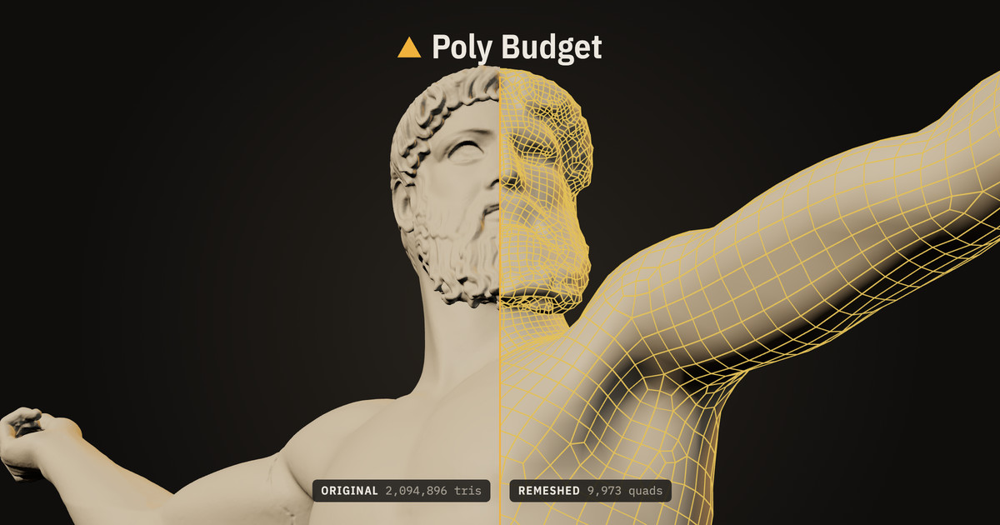
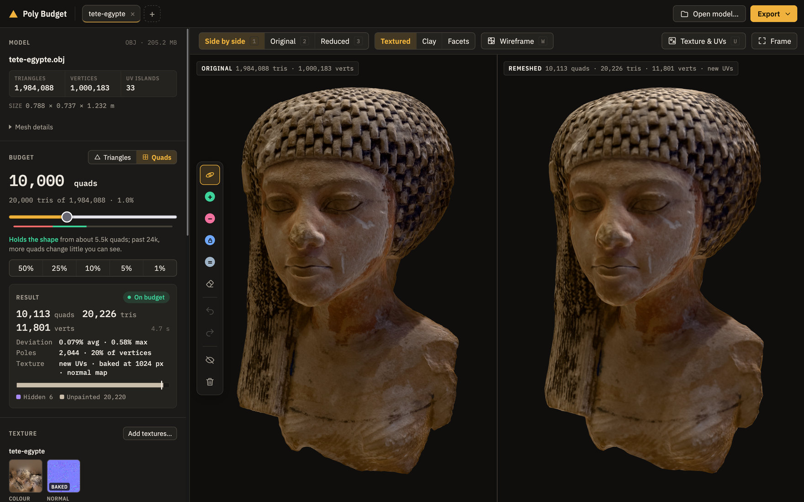
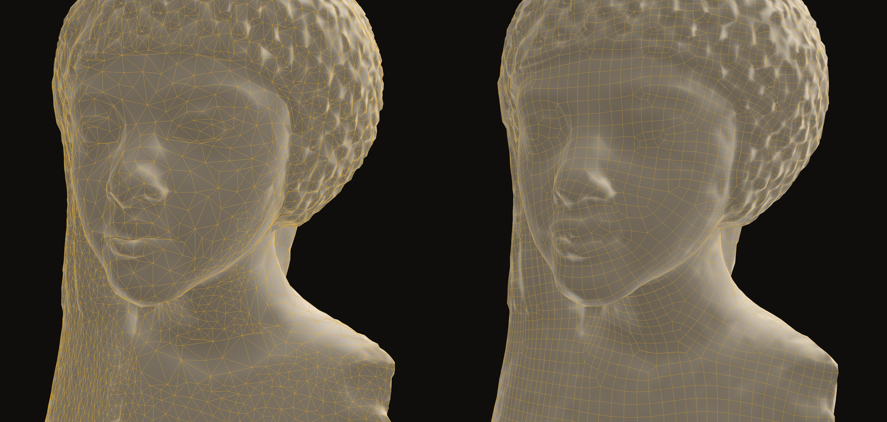
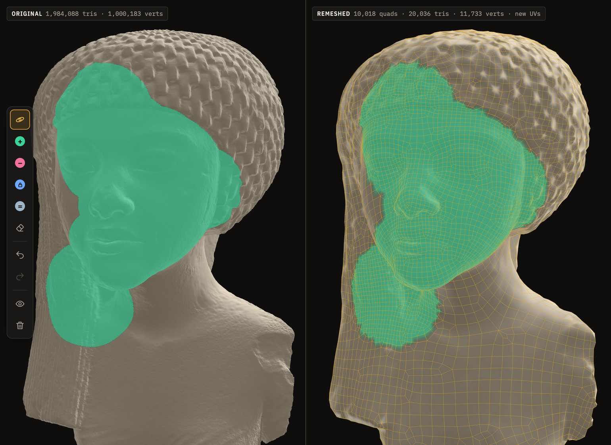
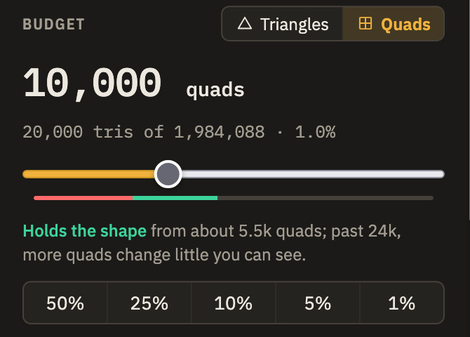
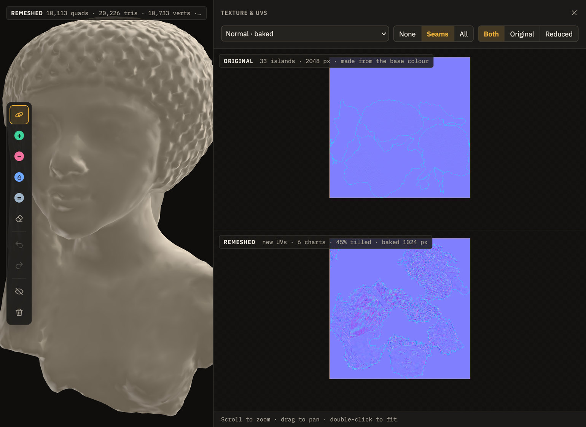
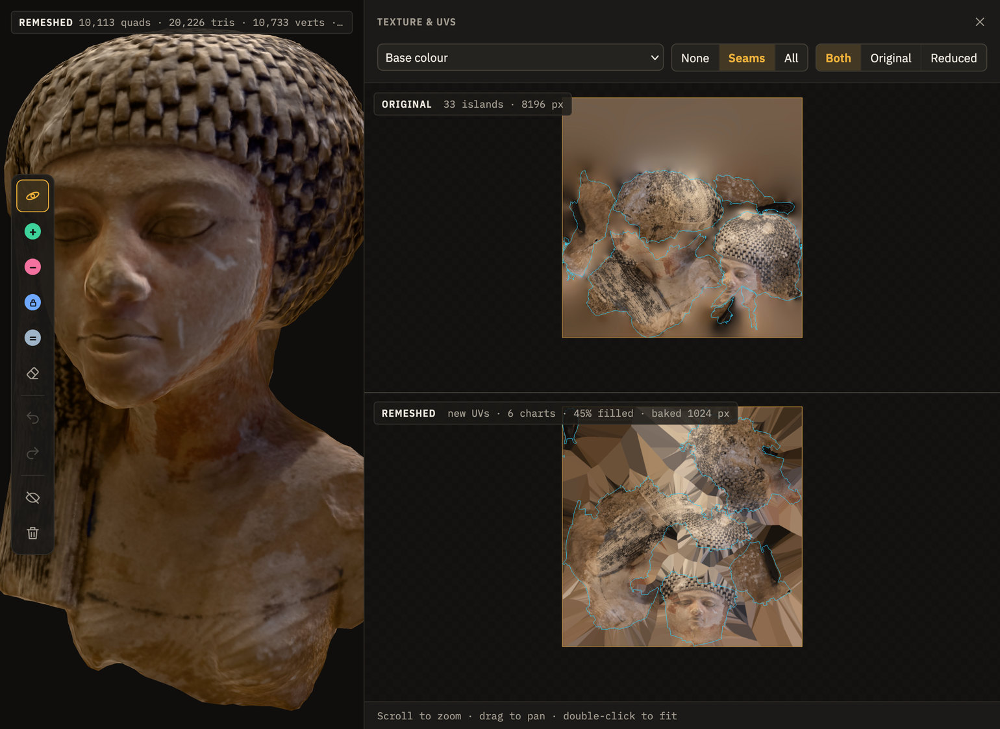
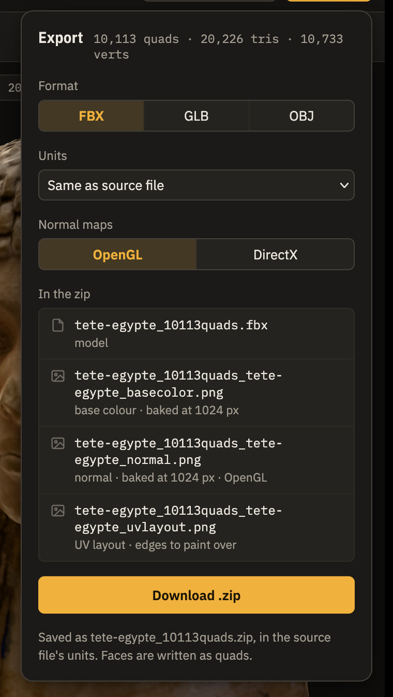

  

<h3 align="center">Heavy 3D models in. Light, clean, ready-to-use models out.</h3>

  

Free · Nothing to install · Your files never leave your computer

 

Scans, sculpts and AI-generated characters often arrive with millions of triangles: beautiful, and far too heavy for a game, an app or a rig. Poly Budget slims them down right in your browser. Choose how many faces you can afford, brush extra detail where it counts, and take home a model that still looks like the original, textures and all.

- **From millions to thousands.** A two-million-triangle scan becomes 10,000 quads that look almost the same once textured.
- **Clean enough to rig.** Quads that follow the form, ready to edit, subdivide and animate.
- **Your textures come along.** Colours and surface detail are carried onto the new model for you.

## Clean quads that follow the form

Poly Budget rebuilds your model as tidy quads whose edges flow around eyes, lips, limbs and folds: the kind of mesh artists like to work with. Rather keep triangles? One click switches, and you get the most shape for the fewest faces.

The same face, the same budget: triangles on the left, quads on the right.

## Spend detail where it counts

Brush **More detail** onto a face or hands, **Less** onto the soles of the shoes, or **Keep** a part as close to the original as it can be. Surfaces nobody will see, like insides, undersides and covered layers, are thinned out on their own.

Paint the face and it gets the finer quads, while the model stays on budget.

## Know when it's enough

Every model needs a different budget, so the slider tells you. **Red** is too few faces to keep the shape, **green** is where to aim, and **gray** adds faces you won't be able to see. No more guessing, and no faces spent that nobody will notice.

 

## Textures that come along

Every texture the model has is carried onto the new one, and a normal map is made from the original's surface, so folds, strands and fine carving still show on a light mesh. That works even for models that never came with a normal map.

## UVs artists can paint

Choose **Paintable** and the texture layout comes in a few large, upright pieces, with the seams tucked where they show least. Paint it in 3D, or open it in your favourite image editor with the layout sheet that comes with the export.

## And the rest of your workflow

- **Mirror symmetry.** Work on one half and the other mirrors it exactly.
- **Compare as you go.** See the original and the result side by side, textured, in clay or as a wireframe.
- **Tabs.** Keep several models open, each with its own paint and settings. Everything reopens just as you left it.
- **Try it straight away.** No model at hand? Start with the built-in sample pawn.

## Ready for your engine

Download a zip with your model as **FBX**, **OBJ** or **GLB**, its textures, and a normal map that looks right in Unity, Unreal, Blender and Godot. The panel shows every file before you download it.

Poly Budget opens **FBX**, **glTF/GLB**, **OBJ**, **STL** and **PLY** files, with **PNG**, **JPG**, **WebP**, **TGA**, **BMP** or **GIF** textures. It runs in a current Chrome, Edge, Firefox or Safari on your desktop.

 

## Three steps

1. **Open** [Poly Budget](https://ozdeger.github.io/poly-budget/) and drop in your model with its textures.
2. **Shape** it: set the budget and paint where you want detail.
3. **Export** the zip and bring it into your engine.

## Private by design

Everything happens on your own computer, inside the browser tab. Your models and textures are never uploaded anywhere, and your open tabs are kept in your browser for next time.

## Good to know

- Bones and animations aren't carried over: you get the model in its rest pose.
- Each model keeps one texture layout.
- Very large models want a desktop computer. A phone may run out of memory.
- Poly Budget needs an internet connection to start.
- The quads are made automatically. They suit most models, but on the trickiest shapes a hand-made retopology still wins, and very thin strands, spokes or cables can come out rough at small budgets.

<b>Keyboard shortcuts</b>

 

| Key | Does |
| --- | --- |
| 1 / 2 / 3 | Side by side / original / reduced |
| Q | Triangles or quads |
| W | Wireframe |
| U | Texture & UVs panel |
| O, M, L, K, N, E | Orbit, More detail, Less detail, Keep original, Normal detail, Erase |
| F | Brush or fill a whole part |
| `[` / `]` | Smaller / larger brush |
| ⌘Z / Ctrl+Z | Undo paint |
| ⇧⌘Z / Ctrl+Y | Redo paint |

## Credits

The pictures show [*Princess from Akhenaton's family*](https://sketchfab.com/3d-models/princess-from-akhenatons-family-5dadcff13f87484a850e6ed027b90452) by Benoit Rogez, from [Real World Textured Things](http://texturedmesh.isti.cnr.it/) ([CC BY 4.0](https://creativecommons.org/licenses/by/4.0/)), and a [plaster cast of the Artemision Bronze](https://commons.wikimedia.org/wiki/File:Poseidon_eller_Zeus_fra_Artemision_-_KAS2100.stl) from Statens Museum for Kunst (CC0), both remeshed by Poly Budget. Poly Budget is built on [three.js](https://threejs.org), [meshoptimizer](https://github.com/zeux/meshoptimizer) and [three-mesh-bvh](https://github.com/gkjohnson/three-mesh-bvh).

## License

Poly Budget is free and open source under the [MIT License](LICENSE). The pictures of scanned models keep their own licences, listed with the other third-party parts in [THIRD_PARTY_NOTICES.md](THIRD_PARTY_NOTICES.md).

Poly Budget is written and kept up to date by an AI coding assistant (Claude, in Claude Code) at its owner's direction. How it works, in detail: [docs/DEVELOPMENT.md](docs/DEVELOPMENT.md).
